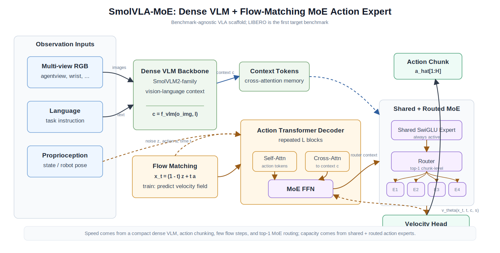

# SmolVLA-MoE

Research codebase for **SmolVLA-MoE: a compact flow-matching VLA with a sparse MoE action expert**.

[](https://github.com/Jinlong-cs/SmolVLA-MoE)
[](https://www.python.org/)
[](https://pytorch.org/)
[](https://wandb.ai/)

This repository contains the training scaffold for SmolVLA-MoE on LIBERO first, with benchmark-agnostic model and data interfaces for future ALOHA / RoboTwin / LeRobot-format datasets.

SmolVLA-MoE is designed around:

- a dense SmolVLM2-family visual-language backbone,
- a continuous flow-matching action decoder,
- a shared + routed sparse MoE FFN inside the action expert,
- top-1 chunk-level routing for efficient inference,
- W&B and local JSONL observability for reproducible benchmark runs.

## Index

- [File Structure](#file-structure)
- [Environment Setup](#environment-setup)
- [Model Design](#model-design)
- [Dataset Preparation](#dataset-preparation)
- [Training](#training)
- [W&B Logging](#wb-logging)
- [Inference and Evaluation](#inference-and-evaluation)
- [Development Status](#development-status)
- [Acknowledgements](#acknowledgements)
- [BibTeX](#bibtex)

## File Structure

```text
SmolVLA-MoE/
├── configs/
│   ├── dataset/
│   │   └── libero.yaml                  # LIBERO / LeRobot data adapter config
│   ├── model/
│   │   └── smolvla_moe_0p5b_active.yaml # SmolVLM2 + MoE action expert config
│   └── train/
│       └── libero_8gpu.yaml             # 8GPU LIBERO training config
├── docs/
│   ├── assets/
│   │   └── smolvla_moe_architecture.svg # README architecture figure
│   ├── architecture.md                  # Design notes and required ablations
│   └── vastai_runbook.md                # Remote training checklist
├── scripts/
│   ├── train.py                         # Single-node / torchrun training entrypoint
│   ├── print_model_size.py              # Parameter count utility
│   ├── serve_libero_policy.py           # OpenPI-compatible policy server
│   └── eval_libero.py                   # LIBERO closed-loop eval wrapper
├── src/smolvla_moe/
│   ├── data/                            # LeRobot/LIBERO data adapter
│   ├── models/                          # Backbone, flow matching, MoE, policy
│   ├── training/                        # Trainer and observability
│   └── utils/
├── outputs/                             # Training outputs, ignored by git
└── checkpoints/                         # External checkpoints, ignored by git
```

## Environment Setup

Create an environment and install the package:

```bash
conda create -n smolvla-moe python=3.10 -y
conda activate smolvla-moe
pip install -U pip

# Install PyTorch for your CUDA version first. Example for CUDA 12.8:
pip install torch torchvision --index-url https://download.pytorch.org/whl/cu128

# Base install
pip install -e .

# Extra dependencies for Hugging Face backbones, LeRobot data, and W&B training logs
pip install -e ".[hf,train]"
```

For development:

```bash
pip install -e ".[hf,train,dev]"
```

## Model Design

<p align="center">
  
</p>

The intended production model uses a SmolVLM2-family backbone and a flow-matching MoE action expert:

```text
RGB cameras + language + proprio
        |
        v
Dense VLM backbone
        |
        v
context tokens
        |
        v
Flow-matching action decoder
  - action self-attention
  - cross-attention to VLM context
  - shared SwiGLU expert
  - top-1 routed SwiGLU expert
        |
        v
continuous action chunk
```

Flow matching defines the continuous action generation objective. MoE defines how the action decoder allocates parameters and compute. They are complementary:

```text
Flow matching: how to generate action chunks.
MoE: which action-decoder expert capacity to use.
```

The default MoE design is:

```text
1 shared expert + 4 routed experts + top-1 chunk-level routing
```

Chunk-level routing is the conservative default because one action chunk shares the same routed expert, which should reduce temporal inconsistency compared with token-level routing.

## Dataset Preparation

The first target dataset is LIBERO in LeRobot format:

```yaml
dataset:
  type: lerobot
  repo_id: physical-intelligence/libero
  image_keys:
    - image
    - wrist_image
  state_key: state
  action_key: actions
```

On the remote training machine, use a persistent Hugging Face cache:

```bash
export HF_HOME=/workspace/.hf_home
export HF_HUB_ENABLE_HF_TRANSFER=1
```

The current LIBERO adapter is intentionally config-driven. Before a long benchmark run, validate the real dataset keys and tensor shapes on the target machine.

## Training

### 1) Print parameter counts

```bash
python scripts/print_model_size.py \
  --config configs/model/smolvla_moe_0p5b_active.yaml
```

### 2) Single-node 8GPU LIBERO training

```bash
export HF_HOME=/workspace/.hf_home
export HF_HUB_ENABLE_HF_TRANSFER=1
export WANDB_API_KEY=...
export WANDB_MODE=online

torchrun --standalone --nproc_per_node=8 scripts/train.py \
  --config configs/train/libero_8gpu.yaml
```

The default run writes outputs to:

```text
outputs/libero/smolvla_moe_full_finetune/
├── checkpoints/
├── metrics.jsonl
└── wandb_id.txt
```

### 3) Required ablations

Before claiming an MoE advantage, compare:

- dense SmolVLA-style action expert,
- same-active SmolVLA-MoE,
- same-total dense action expert,
- MoE with and without shared expert,
- top-1 vs top-2 routing,
- different flow sampling step counts.

## W&B Logging

The trainer follows the same experiment-recording style used in the local FastWAM reproduction: rank-0 W&B logging plus a local `metrics.jsonl`.

Default W&B config:

```yaml
train:
  wandb:
    enabled: true
    workspace: null
    project: smolvla-moe-libero
    name: smolvla_moe_full_finetune_libero
    group: libero_8gpu_full_finetune
    mode: online
    resume: allow
    id_file: wandb_id.txt
    log_first_batch: true
    log_checkpoints: false
```

Logged namespaces:

```text
train/*        loss, flow loss, router losses, grad norm, lr
performance/*  steps/s and samples/s
resource/*     GPU and host resource metrics when available
moe/*          routed expert usage
params/*       total/trainable/backbone/action decoder parameter counts
```

`wandb_id.txt` is written inside the output directory. If the same output directory is reused, `resume: allow` will reconnect to the existing run. Use a fresh `output_dir` or remove `wandb_id.txt` for a new run.

## Inference and Evaluation

The policy sampling interface is implemented through:

```python
actions = policy.predict_action(batch)
```

The LIBERO closed-loop evaluation CLI shape is reserved:

```bash
python scripts/eval_libero.py \
  --checkpoint outputs/libero/smolvla_moe_full_finetune/checkpoints/final.pt \
  --suite all \
  --num-trials 50
```

Closed-loop LIBERO simulation is not wired in this initial scaffold yet. The intended evaluation protocol is:

```text
LIBERO-Spatial, LIBERO-Object, LIBERO-Goal, LIBERO-10
40 tasks x 50 trials
suite-level success and overall success
```

## Development Status

Implemented:

- Hugging Face SmolVLM2 backbone hook,
- flow-matching objective,
- shared + routed MoE action decoder,
- LeRobot/LIBERO adapter scaffold,
- torchrun-compatible trainer,
- W&B and JSONL observability,
- OpenPI-compatible LIBERO policy server and eval wrapper.

Not finished yet:

- validated SmolVLM2 processor/backbone path on the 8GPU machine,
- validated real `physical-intelligence/libero` dataset keys and shapes,
- dense baseline configs,
- LIBERO closed-loop simulator runner,
- released checkpoints and benchmark table.

## Acknowledgements

This project is influenced by recent VLA and robot-learning systems including SmolVLA, pi0/pi0.5, OpenVLA, FastWAM, LeRobot, LIBERO, and sparse MoE designs such as shared/routed expert routing.

## BibTeX

If you find this repository useful, please cite it as:

```bibtex
@misc{smolvla_moe_2026,
  title={SmolVLA-MoE: Compact Flow-Matching VLA with a Sparse MoE Action Expert},
  author={Jinlong Wu},
  year={2026},
  url={https://github.com/Jinlong-cs/SmolVLA-MoE}
}
```
